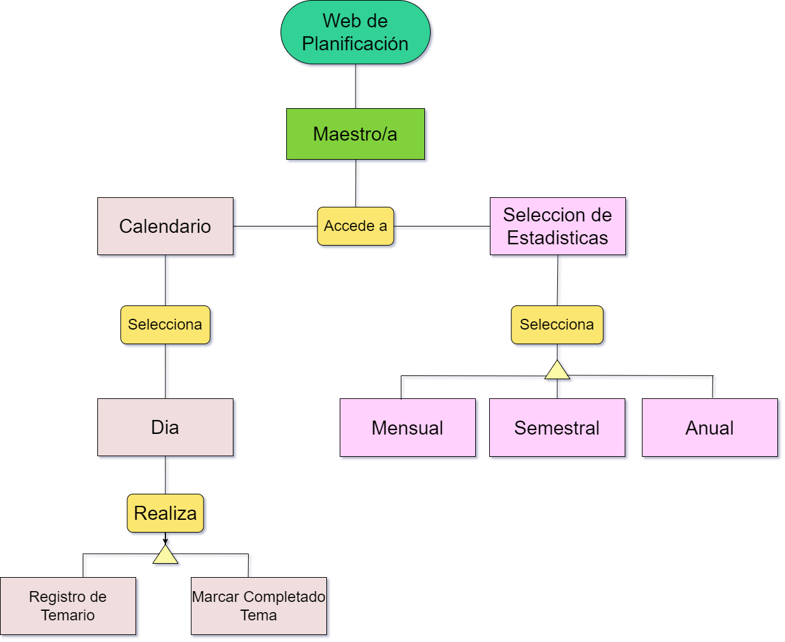
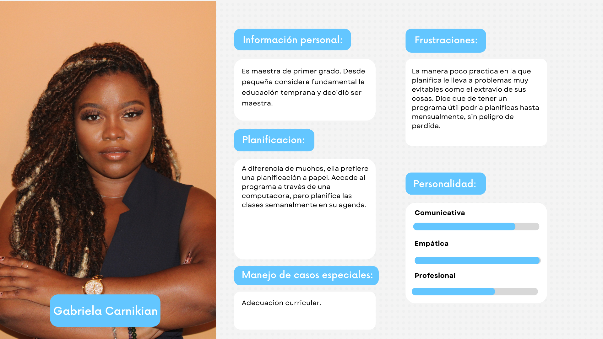
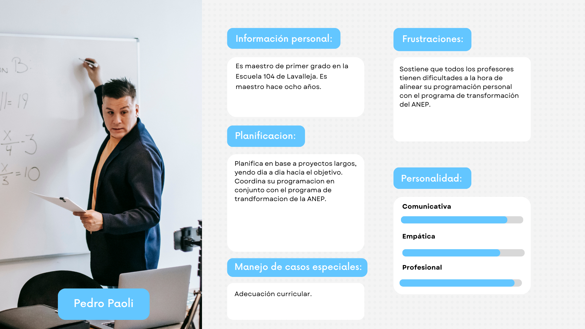
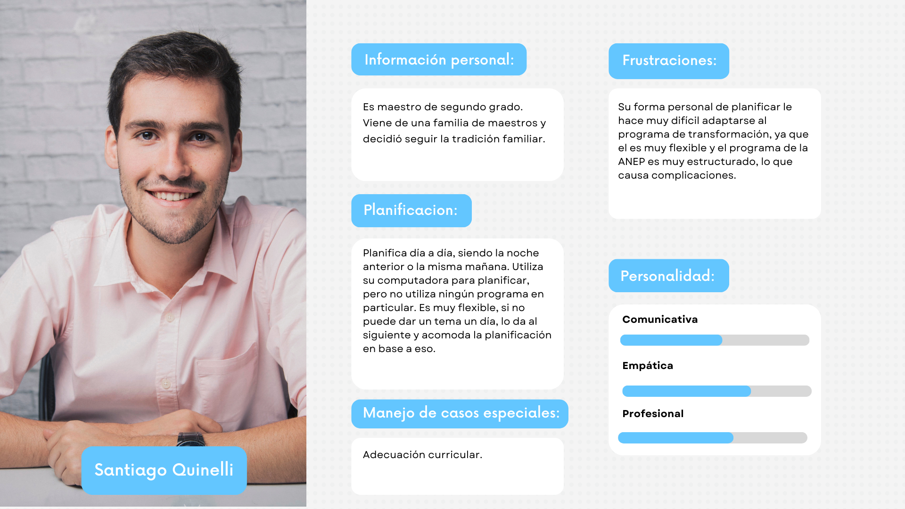
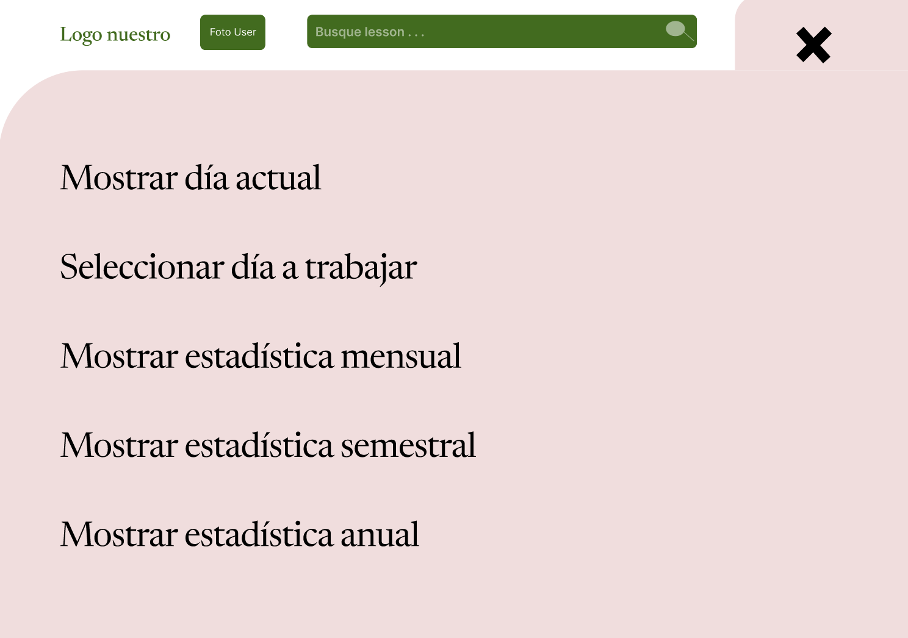
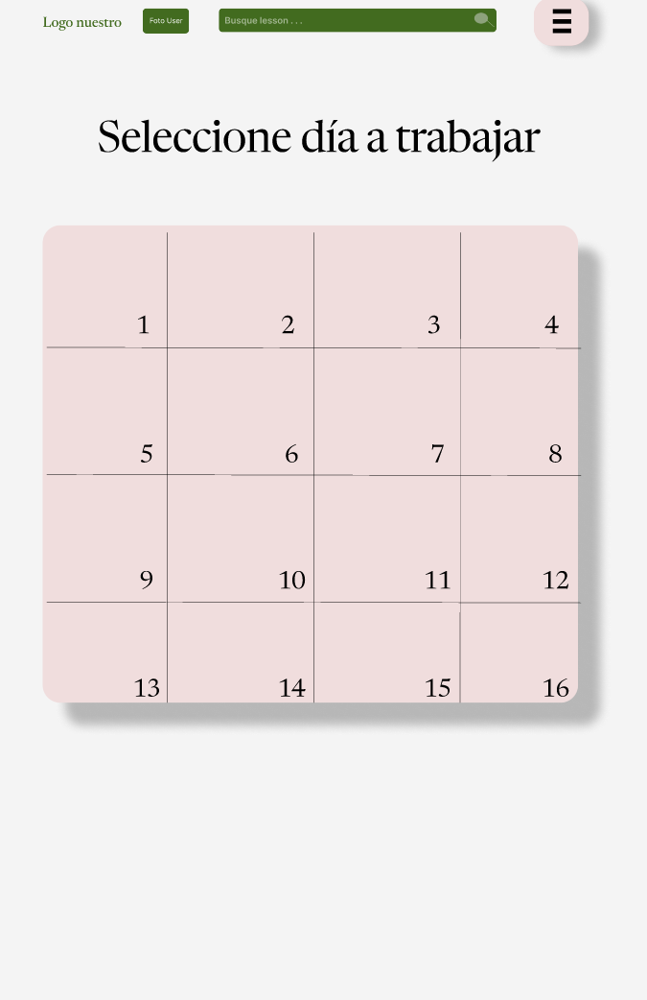
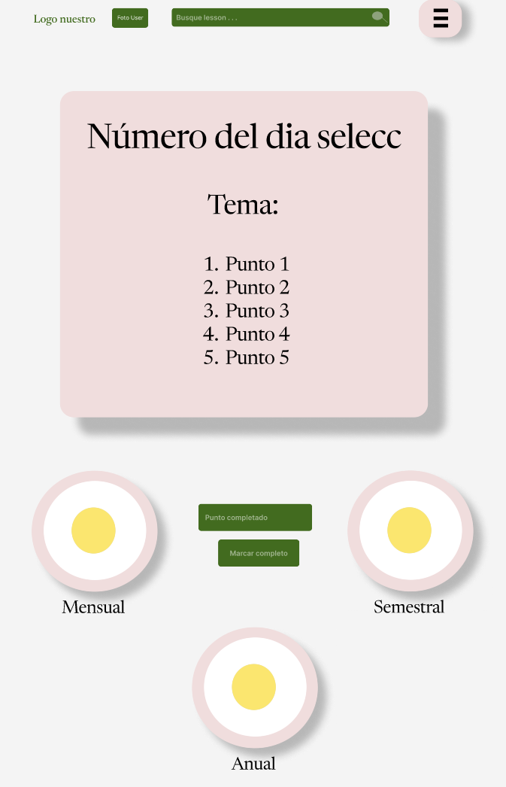
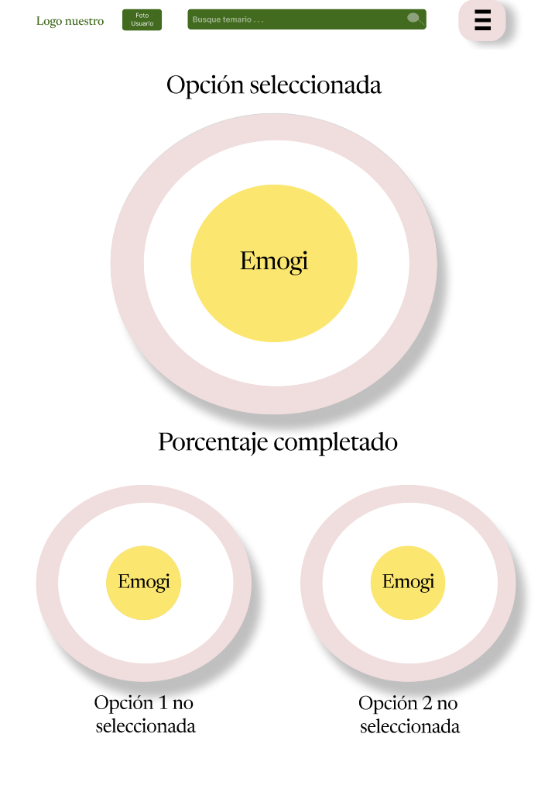

# Informe academico - Primer Checkpoint

## Equipo

- Guillermo Cedrés (306073)
- Luis Lacalle (315135)
- Álvaro Redondo (282016)

### Problema Objetivo

Se deberá investigar y desarrollar un sistema que permita gestionar la planificación semanal de las maestras, estableciendo la alineación con los programas de ANEP (Administración Nacional de Educación Pública) que refieren a unidades curriculares, competencias generales, competencias específicas, contenidos, criterios de logro, plan de aprendizaje, etc.  
Se debe identificar el problema, usuario y objetivo principal. La investigación del problema y delimitación del alcance es responsabilidad de los estudiantes. Se deben especificar en forma detallada los requerimientos que permitan alcanzar los objetivos identificados.

### Introducción

En el ámbito educativo, la planificación semanal de las maestras resulta clave para garantizar un proceso de enseñanza organizado y alineado con los estándares establecidos. El problema principal radica en la falta de un sistema que permita gestionar de manera eficiente esta planificación, asegurando su coherenWcia con los lineamientos de la ANEP (Administración Nacional de Educación Pública). Estos lineamientos incluyen aspectos esenciales como las unidades curriculares, competencias generales y específicas, contenidos, criterios de logro y planes de aprendizaje.

El usuario principal de este sistema serían las maestras, quienes necesitan una herramienta que les permita organizar sus clases de manera que cumpla con las exigencias de la ANEP. El objetivo del proyecto es desarrollar un sistema que facilite esta planificación, optimizando el tiempo y los recursos de las docentes, y mejorando la calidad educativa.

## Repositorio Git

### Repositorios locales y remotos

Curso alternativo

### Aplicación de comandos Git

Los comandos que hemos utilizado son:

- git clone : Clona el repositorio remoto en el dispositivo local.

- git add: Agrega los archivos al área de preparación para el commit.

- git commit -m “(mensaje descriptivo)”: Guarda los cambios en el repositorio con un mensaje que describe los cambios realizados.

- git branch: Crea una nueva rama con el nombre indicado.

- git checkout : Para moverse a otra rama.

- git checkout -b: Crea una rama con el nombre indicado y se mueve a ella.

- git merge : Fusiona los cambios de la rama en la que se está parado con los de la especificada en el nombre.

- git push : Envía los commits locales al repositorio remoto.

- git pull : Descarga los cambios del repositorio remoto y los fusiona con los locales.

## Versionado

1. MAJOR: Se incrementará cuando se realicen cambios significativos que rompan la compatibilidad con versiones anteriores. Esto indica que se han introducido nuevas funcionalidades o cambios que podrían afectar la estabilidad del sistema para los usuarios actuales.

2. MINOR: Se actualizará cuando se añadan nuevas características que sean compatibles con las versiones anteriores. Esto asegura que los usuarios puedan acceder a las nuevas funcionalidades sin afectar el funcionamiento existente.

3. PATCH: Se aumentará cuando se realicen correcciones de errores o mejoras pequeñas que no afecten la estructura ni la funcionalidad general del sistema. Esto será clave para resolver problemas rápidamente sin afectar las características actuales.

## Activades Realizadas

Primera entrevista(Análisis de documentación):
https://chatgpt.com/share/66f70d7c-24d0-8006-a74e-19e4f602ca67

Resumen: Esta entrevista nos sirvio para poder obtener preguntas y una nocion mas amplia sobre el problema planteado por la letra.

## Buenas prácticas de versionado

Programar en ramas es una práctica sencilla que mantiene tu código mas organizado. Las ramas permiten mantener el trabajo "en progreso" separado del trabajo probado, completado y estable. No solamente es una manera efectiva de colaborar con otros sino también de automatizar el despliegue de actualizaciones o arreglos a tus servidores.

#### Beneficios de usar ramas

La mayoría de errores de código encaja en una de estas dos categorías: O estas construyendo una nueva característica o existe un bug con el código base. Un verdadero problema ocurre cuando dos de estas cosas ocurren al mismo tiempo.

#### Mejores prácticas con desarrollo de características y arreglo de problemáticas en ramas.

- Evita realizar commits con trabajo no terminado a la rama de flujo de trabajo.
- Crea una rama en cualquier momento que estés haciendo una tarea no trivial. Esto incluye desarrollo de nuevas características y arreglo de bugs. No olvides eliminar las ramas de características una vez hayan sido mezcladas con la rama de flujo de trabajo. Esto mantendrá tu repositorio limpio.

### Evolución del proyecto

## Elicitación

1. Por qué decidimos aplicar esa tecnica de elicitacion.
2. Como la aplicamos.
3. Evidencia de la aplicacion.
4. Concluisiones a la que llegamos como equipo.

- Analisis de Documentos.

1. Se utilizó para poder ver a grandes rasgos los problemas comunes que tienen las maestras.
2. Se aplicó pidiendole a la ia que se hiciera pasar como maestra de primaria y así poder preguntarle preguntas específicas.
3. Su evidencia está tanto en Evidencia de Actividades de investigación como en las preguntas que se les hizo a las maestras.
4. Luego de hacer entrevistas a maestras reales se llegó a la conclusión de que la ia cosultada en algunos puntos estaba en lo cierto.

- Entrevistas

1. Se utilizó para poder ver a grandes rasgos los problemas comunes que tienen las maestras a la hora de organizar clases.
2. Se aplicó haciendole preguntas importantes a personas del rubro.
3. Su evidencia está en nuestro diseño IU, donde tratamos de solucionar los grandes problemas planteados por las personas entrevistadas.
4. Se vió que muchas maestras tienen los mismos problemas generales a la hora de organizar clases.

## Análisis de documentación

- La entrevista fue realizada a GPT 4o mini, haciendose pasar por una docente con experiencia en la enseñanza de segundo de primaria en Uruguay.
- Decidimos entrevistar a GPT 4o mini porque su experiencia en el aula nos brinda una perspectiva directa sobre las necesidades y desafíos que enfrentan los docentes en la planificación semanal. Además, su opinión puede ser clave para desarrollar un sistema que atienda las necesidades de los educadores.
- En base a esto, formulamos una serie de preguntas significativas que guiarían la entrevista y nos permitirían obtener información valiosa.
- Conclusiones: Para el desarrollo de nuestro sistema de planificación semanal para docentes de segundo de primaria en Uruguay, nos basamos en las respuestas de la entrevista a GPT 4o mini. La perspectiva de GPT 4o mini nos brindaron información valiosa sobre las necesidades de los educadores y cómo nuestro sistema puede atenderlas.
- Nuestro principal objetivo es crear una plataforma diseñada para facilitar la planificación, ejecución y seguimiento de las actividades educativas de manera eficiente e intuitiva. Buscamos ofrecer un entorno organizado donde todos los recursos estén centralizados, y los docentes puedan gestionar su planificación de forma sencilla.
- Por último, se implementará un sistema de alertas y notificaciones, en respuesta a la necesidad expresada por GPT 4o mini sobre la importancia de recordar tareas y actividades.
- Creemos que la información obtenida de esta entrevista será importante para el desarrollo de nuestra plataforma. Aunque inicialmente nos enfocamos en ciertas funcionalidades, hemos identificado otras que podrían ser beneficiosas en el futuro para enriquecer aún más nuestro sistema

### Evidencia de actividades de investigación

### Entrevista:

1. Entrevista:

   https://youtu.be/IYSwV3bbZts

   - Conclusión: Pedro planifica en base a proyectos y ve el progreso de todos los dias, utiliza la computadora para planificar todos los dias, es un caso en el que podriamos tener gran influencia para así falicitarle su planificación.

2. Entrevista:

   https://youtu.be/HiCcjz817pw

   - Conclusión: El utiliza una herramienta a mano como un drive, con nuestra página podriamos solucionarle muchos problemas y un uso diario mas práctico.

3. Entrevista:

   https://youtu.be/n7qCJLryvAk

   - Conclusión: Podriamos ayudar a Gabriela con su falta de tiempo ya que se podria apoyar con otros docentes del mismo curso y al tener más información le resultará mas fácil.

4. Entrevista:

   https://youtu.be/2OUQCqXco6s

   - Conclusión: Facundo planea todos los dias y va corrigiendo en su camino, tal vez en nuestra pagina puede ser para su ayuda ya que va a tener una vista más amplia y clara de todos los dias.  
      Capaz a la hora de no saber como abarcar un tema se podría ayudar de material de otros maestros.

### Referencias a fuentes de información

1. "Entrevista a Chat GPT"

   1. ¿Cuáles son los principales desafíos que enfrentas al planificar tu semana educativa?

      - “La falta de tiempo y la necesidad de ajustar los contenidos al ritmo de aprendizaje de los niños.”

   2. ¿Qué características consideras esenciales en una herramienta de planificación para tu clase?

      - “Debe ser fácil de usar, accesible desde diferentes dispositivos y permitir compartir información con otros docentes.”

   3. ¿Cómo te gustaría que el sistema te ayude a gestionar las actividades y recursos educativos?

      - “Que tenga una base de datos donde pueda almacenar recursos y actividades que ya utilicé y me permita organizarlos por temática o nivel de dificultad.”

   4. ¿Qué herramientas te parecen más útiles en una plataforma de planificación?

      - “Un calendario para visualizar las actividades, una sección para notas y recordatorios, y opciones de colaboración con otros docentes.”

   5. ¿Qué funciones específicas le incorporarías a la plataforma?

      - “Una opción para adjuntar materiales digitales y un sistema de alertas para recordatorios de tareas.”

   6. ¿Tienes experiencia previa con plataformas de planificación? ¿Cuál?

      - “He utilizado Google Calendar y Trello, pero ninguna se adapta completamente a mis necesidades como docente.”

   7. ¿Qué medidas de seguridad te gustaría que se implementaran para proteger tus datos en la plataforma?

      - “Que mis datos y materiales sean privados y que solo los docentes autorizados puedan acceder a la información compartida.”

   8. ¿Cómo te gustaría recibir notificaciones sobre la planificación semanal?

      - “Por correo electrónico o a través de la misma plataforma, para que no me pierda de ningún aviso importante.”

   9. ¿Cómo podría facilitar la plataforma la comunicación y colaboración entre docentes?

      - “Un chat interno o foros donde podamos compartir experiencias y recursos sería muy útil.”

### Caracterización de usuarios

1. Perfil del usuario:

- Los usuarios principales de la plataforma serán **maestros de primaria**, específicamente de segundo grado, quienes necesitan una herramienta para organizar su planificación semanal, mensual y anual.
- **Nivel de conocimientos tecnológicos**: Varía entre usuarios. Algunos maestros estarán muy familiarizados con la tecnología y otros preferirán soluciones más simples y tradicionales, como el uso de papel. Esto implica que la plataforma debe ser intuitiva y fácil de usar, incluso para quienes no son expertos en tecnología.

2. Necesidades principales:

- **Organización y planificación eficiente**: Los maestros necesitan una herramienta que les permita planificar de manera ordenada las clases, registrar los temas del día y marcar el progreso. Esto les ayuda a seguir un plan estructurado sin perder de vista el contenido que ya han cubierto.
- **Flexibilidad**: Los usuarios requieren poder ajustar la planificación día a día según la evolución de sus clases. Necesitan una herramienta que les permita modificar fechas, contenidos y enfoques fácilmente.
- **Visualización del progreso**: Es importante que la plataforma ofrezca estadísticas mensuales, semestrales y anuales que les permitan tener una visión clara de su avance y de las áreas que aún deben reforzar.

3. Frustraciones comunes:

   1. Gabriela Carnikian:

      - User story: Como maestra de primer grado, quiero una forma más segura y práctica de organizar mis clases para no perder el material que ya he planificado. Me frustra depender del papel, ya que es fácil extraviar mis anotaciones.

   2. Pedro Paoli:

      - User story: Como maestro de primer grado, quiero que mi programación esté alineada con el programa de transformación de ANEP para evitar las dificultades de integración y asegurarme de cumplir con los objetivos educativos de manera eficiente.

   3. Santiago Quinelli:

      - User story: Como maestro de segundo grado, me gustaría una herramienta más flexible que se ajuste a mi forma de planificar día a día sin complicaciones, y que a la vez me permita cumplir con el programa estructurado de ANEP, ya que mi método personal de planificación es demasiado informal para este sistema.

4. Expectativas del usuario:

- Esperan que la plataforma les permita planificar de manera más eficiente, reduciendo el tiempo que dedican a organizar las clases y asegurando que no se pierda información importante.
- Desean una herramienta que se integre con sus necesidades diarias sin ser una carga adicional, y que sea visualmente clara y fácil de manejar.

5. Conclusión:

- La plataforma debe enfocarse en ofrecer una experiencia de usuario sencilla pero poderosa, que les permita a los maestros planificar de manera flexible y visualizar su progreso sin complicaciones técnicas. Al entender las necesidades y frustraciones de los usuarios, el diseño de la herramienta estará alineado con lo que realmente valoran: facilidad, flexibilidad y eficiencia.

### Modelo conceptual del problema

El modelo conceptual del problema nos permite comprender de forma clara los aspectos que involucran la planificación y ejecución de actividades educativas en las aulas de primaria. Nos ayuda a identificar los requerimientos más importantes para el sistema y a evitar errores en su implementación, ya que permite visualizar todos los elementos y sus interacciones.

Objetivo General: Facilitar la planificación y gestión de las actividades educativas para docentes, asegurando un acceso adecuado a la información.

Elementos Clave:

1. Usuarios:

   - Docentes: Necesitan herramientas intuitivas para planificar y gestionar sus actividades diarias.

2. Funcionalidades:

   - Base de datos para almacenar recursos y actividades.
   - Calendario para la organización de actividades.

3. Desafíos:

   - Falta de tiempo para la planificación efectiva.
   - Necesidad de una interfaz intuitiva y fácil de usar.

4. Requisitos de Seguridad:

   - Protección de datos de usuarios.

## Especificación

### Requerimientos funcionales y no funcionales

#### Requerimientos Funcionales:

1. Creacion de Usuarios (importancia: Alta):

- Los clientes podrán registrarse en la plataforma proporcionando información básica como nombre, correo electrónico, contraseña, teléfono y fecha de nacimiento. Una vez registrados, podrán acceder a sus cuentas utilizando sus credenciales. Para sumar, pueden cambiar sus datos si es necesario.

2. Planificación Semanal (importancia: Alta):

- Los usuarios podrán diseñar la modalidad de dictado de curso semanal.

3. Visualización de progreso (importancia: Baja):

- Los usuarios prodrán ver el progreso mensual, semestral y anual.

4. Calendario Interactivo (importancia: Media):

- Un calendario que permita organizar y visualizar el horario de clases, actividades y eventos escolares de forma diaria, semanal y mensual.

5. Planificación de Lecciones (importancia: Alta):

- Herramientas para crear, editar y almacenar planes de lecciones, incluyendo objetivos, contenidos, metodologías, recursos y evaluaciones.

7. Organizar feriados y fechas festivas (importancia: Media):

- En el calendario estarán marcados dias festivos y feriados no laborables.

8. Notificaciones y Recordatorios (importancia: Alta):

- Sistema de alertas para fechas importantes, reuniones y otros eventos relevantes.

9. Personalización de la Interfaz (importancia: Baja):

- Posibilidad de ajustar el color de fondo y color de letra según las preferencias de cada docente.

10. Temario dado y por ver (importancia: Alta):

- La plataforma ofrece la posibilidad de visualizar el progreso de las clases previas, viendo que temas han sido abarcados, pendientes y por abarcar. El progreso se presentará de forma gráfica.

#### Requerimientos NO Funcionales:

1. Acceso Multiplataforma (importancia: Alta):

- Compatibilidad con diversos dispositivos como computadoras, tablets y smartphones, permitiendo acceso desde cualquier lugar y en cualquier momento.
- Diseño responsivo que se adapte a diferentes tamaños y resoluciones de pantalla.

2. Usabilidad (importancia: Alta):

- La plataforma debe ser intuitiva y fácil de navegar para usuarios con diferentes niveles de experiencia tecnológica.
- Debe ofrecer una interfaz coherente y consistente en todas sus funcionalidades.
- Permitir la personalización de la interfaz sin complicar su uso (por ejemplo, ajustar colores de fondo y letra)

3. Disponibilidad (importancia: Alta):

- La plataforma debe estar disponible al menos el 99.9% del tiempo, excluyendo mantenimientos programados.

4. Compatibilidad (importancia: Alta):

- Compatibilidad con los principales navegadores web (Chrome, Firefox, Safari, Edge).

5. Mantebilidad (importancia: Media):

- Código fuente bien documentado y estructurado siguiendo estándares de programación.
- Facilitar actualizaciones y mantenimiento sin interrumpir el servicio a los usuarios.

6. Experiencia de Usuario Personalizada (importancia: Alta):

- Las opciones de personalización no deben afectar el rendimiento ni la funcionalidad general.

7. Experiencia de Usuario Consistente (importancia: Media):

- Feedback Inmediato: Respuestas rápidas y mensajes claros ante las acciones del usuario.
- Manejo de Errores: Mensajes de error informativos y soluciones propuestas para guiar al usuario en caso de problemas.

8. Cumplimiento de Estándares Web (importancia: Media):

- Utilización de estándares actuales para maximizar la compatibilidad y el rendimiento.

### User stories

### Use cases

1. Caso de Uso: Mostrar Día Actual

- Actor: Maestro/a
- Descripción: El sistema muestra el día actual para que el usuario pueda seleccionar un temario relacionado.
- Precondiciones: El maestro debe estar autenticado en el sistema.
- Flujo Principal:
  1. El maestro accede al sistema.
  2. El sistema muestra el día actual en el calendario.
  3. El maestro selecciona el día actual.
  4. El sistema muestra el temario del día actual. (si esta ingresado)
- Postcondiciones: El temario del día actual se muestra correctamente.

2. Caso de Uso: Seleccionar Día a Trabajar

- Actor: Maestro/a
- Descripción: El maestro puede seleccionar un día específico del mes para trabajar en el temario asociado a ese día.
- Precondiciones: El maestro debe estar autenticado en el sistema.
- Flujo Principal:
  1. El maestro accede al calendario.
  2. El sistema muestra un calendario con todos los días del mes.
  3. El maestro selecciona un día específico.
  4. El sistema muestra el temario correspondiente al día seleccionado.
- Postcondiciones: El temario correspondiente al día seleccionado es mostrado.

3. Caso de Uso: Marcar Tema Como Completo

- Actor: Maestro/a
- Descripción: El maestro marca un tema del día como completo una vez ha sido trabajado.
- Precondiciones: El maestro debe haber seleccionado un día de trabajo y estar autenticado.
- Flujo Principal:
  1. El maestro selecciona un día de trabajo.
  2. El sistema muestra el temario del día.
  3. El maestro marca el tema como completo.
  4. El sistema actualiza el estado del tema a "completado".
- Postcondiciones: El sistema actualiza el estado del tema como completado.

4. Caso de Uso: Mostrar Estadísticas Mensuales, Semestrales y Anuales

- Actor: Maestro/a
- Descripción: El sistema muestra las estadísticas del progreso del maestro/a en función del porcentaje de temas completados, de manera mensual, semestral o anual.
- Precondiciones: El maestro debe haber trabajado en varios días y haber marcado temas como completados.
- Flujo Principal:
  1. El maestro accede a la sección de estadísticas.
  2. El sistema le permite seleccionar entre estadísticas mensuales, semestrales o anuales.
  3. El maestro selecciona una de las opciones.
  4. El sistema muestra las estadísticas correspondientes al periodo seleccionado.
- Postcondiciones: Las estadísticas correspondientes al periodo seleccionado son mostradas.

5. Caso de Uso: Buscar Temario por Palabra Clave

- Actor: Maestro/a
- Descripción: El sistema permite que el maestro busque un temario por palabra clave.
- Precondiciones: El maestro debe estar autenticado en el sistema.
- Flujo Principal:
  1. El maestro accede a la barra de búsqueda.
  2. El maestro ingresa una palabra clave relacionada con el temario.
  3. El sistema muestra dia con temario correspondienta a la palabra clave.
  4. El maestro selecciona resultado.
  5. El sistema redirige al dia del temario seleccionado.
- Postcondiciones: El temario correspondiente a la búsqueda es mostrado.

### Bocetos de IU

## Checkpoint obligatorio 1

Incluir un resumen del avance en elicitación y especificación de requerimientos
Se evaluará de acuerdo al grado de avance

## Validación y verificación

### Verificación

Verificación de los Requerimientos:

Completitud

    ¿Se encuentran todos los requerimientos correctamente priorizados?
    Si se ha mencionado una priorización explícita de los requerimientos en el informe.

    ¿Son todas las clases de usuarios identificados y sus características descriptas?
    Solo se menciona a las maestras como usuarios principales, pero no se detallan sus características.

    ¿Se identifican y describen las dependencias con otros sistemas?
    No se han descrito dependencias con otros sistemas.

    ¿Están todas las características de calidad tenidas en cuenta en la especificación?
    Si se mencionan características de calidad como usabilidad, seguridad o rendimiento (disponibilidad) en los requerimientos.

Verificabilidad y no ambigüedad

    ¿Tiene cada requerimiento una única interpretación?
    Los requerimientos si están redactados de manera explícita en el informe.

    ¿Puede ser cada requerimiento verificado por alguna prueba, demostración, revisión o análisis?
    Ciertos requerimientos si podrian ser verificados bajo pruebas.

Correctitud y consistencia

    ¿Están los requerimientos escritos en forma consistente y a un nivel de detalle adecuado?
    Los requerimientos están definidos de manera clara en el informe.

    ¿Existe duplicación de requerimientos o conflicto entre requerimientos?
    No hay requerimientos duplicados.

    ¿Está cada requerimiento dentro del alcance del problema a resolver?
    Los objetivos están alineados con el problema y los requerimientos están al alcance.

    ¿Evitan los requerimientos incluir aspectos de diseño o implementación de la solución?
    Los aspectos de diseño e implementación no están mencionados en los requerimientos.

Trazabilidad

    ¿Puede cada requerimiento ser identificado correctamente y en forma única?
    Los requerimientos están presentes de manera formal, por lo que si pueden ser identificados correctamente y de forma unica.

    ¿Se referencian correctamente los requerimientos entre sí?
    No hay referencias entre los requerimientos.

    ¿Puede cada requerimiento ser referenciado hasta su origen (alguna necesidad de los stakeholders)?
    No se ha trazado ningún requerimiento hasta su origen con los stakeholders.

Verificación de los Casos de Uso:

    ¿Cumple el caso de uso un único objetivo o tarea?
    Sí, cada caso de uso tiene un objetivo claro, como "Buscar Temario por Palabra Clave" o "Mostrar Estadísticas de Progreso".

    ¿Es su objetivo un resultado medible para el usuario?
    En general, sí. Por ejemplo, la "Mostrar Estadísticas de Progreso" ofrece un resultado medible.

    ¿Queda claro qué actor(es) participan y benefician del caso de uso?
    Sí, los actores son las maestras y están claramente identificados en los casos de uso.

    ¿Existe una secuencia lógica en los pasos que permita entender la transacción entre actor y sistema?
    Sí, los pasos están bien detallados y siguen una secuencia lógica.

    ¿Es el nivel de abstracción de las transacciones adecuado para el caso de uso?
    Sí, el nivel de detalle es suficiente para entender el flujo sin entrar en detalles de implementación.

    ¿Está el caso de uso libre de detalles de diseño e implementación de posibles soluciones?
    Correcto, no se incluyen detalles de diseño o implementación en los casos de uso.

    ¿Se documentan todos los posibles cursos alternativos y excepcionales?
    No se mencionan cursos alternativos o excepcionales.

    ¿Existen pre y pos condiciones que contextualicen correctamente el caso de uso?
    Las precondiciones están mencionadas, pero las poscondiciones no están siempre claras.

### Validación

1. Interfaz de Usuario (UI):

   - Lo que veo: La interfaz se ve ordenada y clara. Me gusta que todo esté centrado y visualmente limpio, lo que hace que sea fácil de entender.

2. Funcionalidad:

   - Registro de Temario y Marcar Completo: Las opciones de marcar como completado o registrar un temario parecen claras. Tener botones como “Punto completado” y “Marcar completo” me facilita registrar el progreso del día.
   - Sugerencias: Podrías agregar algún tipo de confirmación visual al hacer clic en los botones (como un pequeño cambio de color o un ícono de check) para que yo sepa que la acción fue exitosa.

3. Selección de Día a Trabajar:

   - Lo que veo: La opción de seleccionar un día en un calendario es muy intuitiva. Me ayuda a planificar con antelación y es visualmente claro.

4. Visualización de Estadísticas:

   - Lo que veo: Las opciones de estadísticas mensual, semestral y anual están claras. Me permite ver el progreso de una manera más amplia.

5. Usabilidad General:

   - Lo que veo: La navegación es sencilla y directa. El menú desplegable en la parte superior con opciones como "Mostrar día actual" o "Seleccionar día a trabajar" está bien posicionado y me facilita moverse entre las diferentes opciones.

   - Sugerencias: Considera agregar una opción para regresar rápidamente al inicio o agregar un pequeño tutorial para nuevos usuarios, para asegurar que nadie se pierda al usar el sistema por primera vez.

6. Satisfacción de Necesidades:

   - Lo que veo: La herramienta tiene un enfoque en facilitar la planificación diaria, mensual y anual, lo cual es exactamente lo que necesito como maestro.

## Reflexión

### Detalle del trabajo individual

Detallar: fecha, actividad, horas, responsable
Incluir totales de esfuerzo

### Técnicas aplicadas y aprendizajes

Álvaro Redondo Motta:

1. Técnicas aplicadas:

   - Análisis y entrevistas: Usamos el análisis de documentos para entender los problemas de las maestras, complementado con entrevistas a maestras reales y simuladas por IA. Esto nos ayudó a identificar patrones en sus dificultades de planificación y a pensar soluciones prácticas.

1. Prototipado con Figma:

   - Aprendí a usar Figma para diseñar interfaces, lo que fue fundamental para visualizar la plataforma de planificación de manera clara y atractiva. Me permitió crear un entorno más intuitivo para los usuarios.

1. Validación de la interfaz:

   - Después de varias pruebas, ajustamos el diseño de la plataforma para que fuera más sencilla de usar.
   - Incorporamos un calendario intuitivo y opciones de seguimiento de progreso que respondían directamente a las necesidades de las maestras entrevistadas.

1. Aprendizajes clave:

   - El uso de Figma fue crucial para visualizar ideas rápidamente.

   - Las entrevistas mostraron que muchos de los problemas de las maestras son comunes, lo que permitió diseñar una interfaz más eficiente.

   - Mantener el código ordenado y trabajar en ramas mejoró la eficiencia del equipo y ayudó a evitar errores.

Guillermo Nicolás Cedrés Martínez:

1. Técnicas aplicadas:

   - Análisis y entrevistas: Utilicé la información a mi disposición para salir al campo a realizar entrevistas a los maestros.

1. Editar video con inShot:

   - Para realizar la edición de los videos de las entrevistas tuve que informarme como funcionaba esta aplicación para que quede lo mejor posible, poner subtitulos en la estrevista de Gabriela, colocar imagén en la de Facundo y hacer recortes en el video para que quede prolijo.

1. Salir a entrevistar gente que no conozco es algo que me va a ayudar en esta materia para el siguiente obligatorio ya que vamos a seguir necesitando de la misma herramienta porque necesitaremos feedback del cliente y presentarle lo que hemos hecho con sus entrevistas pasadas

1. Aprendizajes clave:

   - El uso de inShot fue esencial.

   - Las entrevistas nos ayudaron a sacar conclusiones para entender su planificación.

Luis Alberto Lacalle:

1. Tecnicas aplicadas:

- Uso de canva: Retomé el uso de Canva como plataforma de diseño grafico para las caracterizaciones de usuario. Previamente en el liceo ya habia usado esta plataforma pero habiendo perdido conociemiento, tuve que reencontrarme y repasar sus funciones basicas.

1. Aprendizajes clave:
   - El user story es clave para poder conocer al usuario desde una forma mas visual y ordenada
   - El user case ayuda mucho a poder diseñar el programa en funcion de una necesidad especifica y personal
